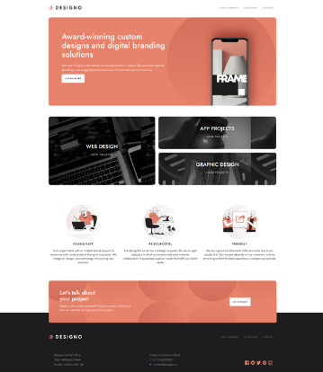

# Designo - built with React

## What I used to build this amazing project

* React
* Webpack and babel
* CSS and HTML

## Live Version

Please follow this url to run my application: https://reliable-kashata-ceebf9.netlify.app/

##  Contact 👋
If you find any issues or you want to share your feedback, please email me at busygina.rita.ca@gmail.com

Thanks for checking out one of my projects

Completed by Margarita Busygina
Ottawa, Canada
June-July 2022